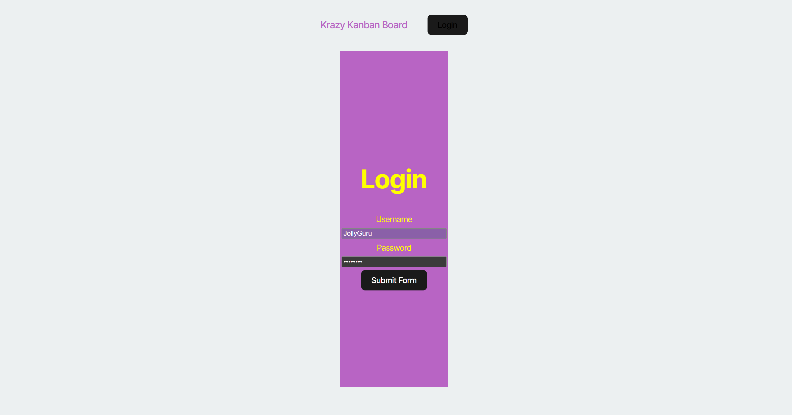
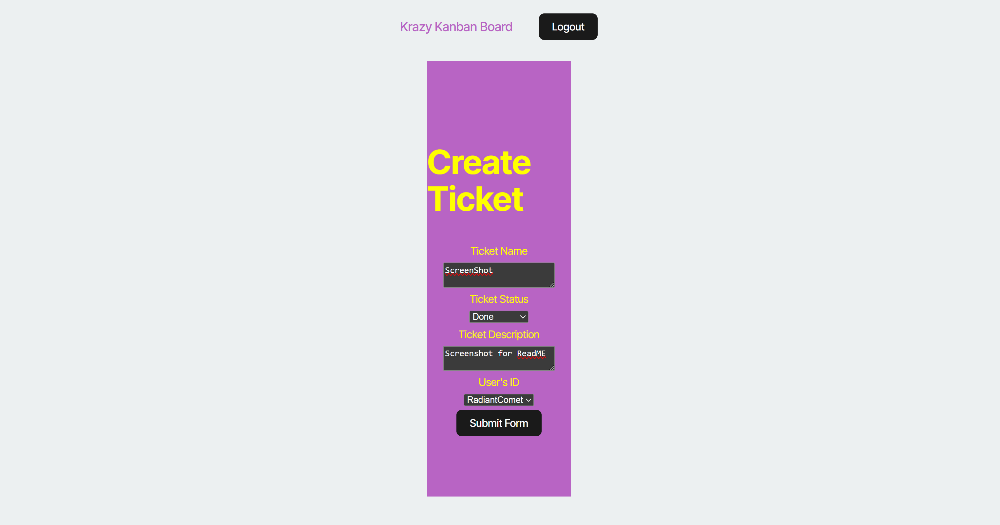
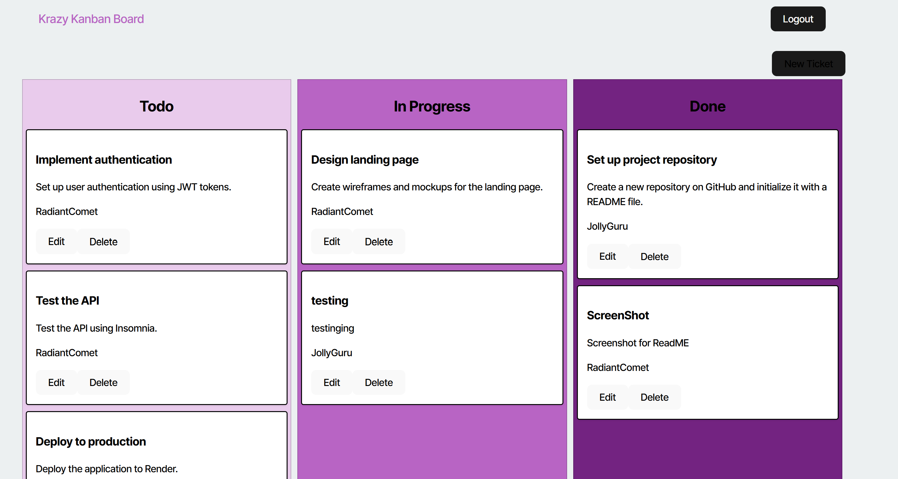

# SecureBoard

Welcome to **SecureBoard**, a full-stack Kanban board application with secure authentication using JSON Web Tokens (JWT). Built with React, Vite, TypeScript, Express, and Sequelize, this app enables authenticated users to manage and organize tasks in a visually intuitive Kanban-style board. Designed with modern deployment in mind, the entire application is deployed on Render and backed by PostgreSQL. Since there is no sign-up function use this pre-seeded login (User: JollyGuru, Password: password) 

---

## Live Site

**[View Deployed Application on Render](https://secureboard.onrender.com/)**

---

## Screenshots

### Login Page  

### Kanban Ticket  

### Kanban Board  

---

## Technologies Used

- React
- Vite
- TypeScript
- React Router DOM
- Node.js & Express
- PostgreSQL & Sequelize
- JSON Web Tokens (JWT)
- Bcrypt
- Render (Deployment)

---

## Features

-  **Secure Login** — Users authenticate via JWT and can only access the board after login.
-  **Task Management** — Create, update, and delete tickets based on task status.
-  **Persistent State** — JWT tokens stored in `localStorage` and used for protected API access.
-  **Responsive UI** — Clean, organized layout built with modern UI practices.
-  **Deployment Ready** — Fully deployed backend and frontend hosted as a monorepo on Render.

---

## Developer

**Chris Munoz**

- **Email:** chrismunozpro@email.com  
- **GitHub:** [FadedSetton](https://github.com/FadedSetton)

---

## License

MIT
